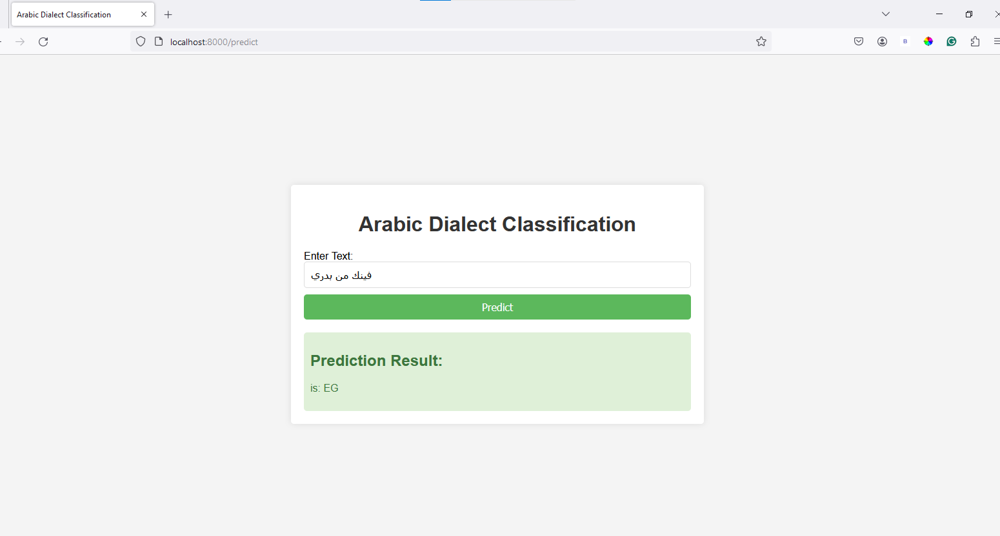

# Arabic Dialect Identification
This NLP project purpose is to predict the dialect of Arabic language in tweets

# Dataset
The dataset used in this project is a collection of Tweets labeled with their corresponding dialects, The dialects are from 5 countries which are Egypt ('EG'), Lebanon ('LB'), Libya ('LY'), Sudan ('SD'), and Morocco ('MA') and it's discussed in this paper 


# Expriments 

in this project i used variety of models here is a summary of the results:

| Model         | F1_score | accuracy_val  |
| ------------- |:-------------:| -----:        |
|      TF-IDF Multinomial Naive Bayes       | 0.69          |    0.72 	|
|    LSTM    |   0.82      |     0.82	|
|      GRU      |   0.79       |    0.79	|
|      Hybrid Model `char and token embeddings`      | 0.80          |    0.80 	|
|       Arabert    | 0.84          |    0.84
 	
# The API and sample output

* The api created using FastAPI
* tested the app



# How to Run 
1. Clone the Repository
```
git clone https://github.com/ronysalem/Arabic-Dialect-Identification
```

2. Navigate to the Project Directory
```
cd Arabic-Dialect-Identification
```


3. Build and Run the Docker Container
```
docker-compose up --build
```

4. Accessing the Application
Once the application is running, you can access it by opening a web browser and visiting:
```
http://localhost:8000
```